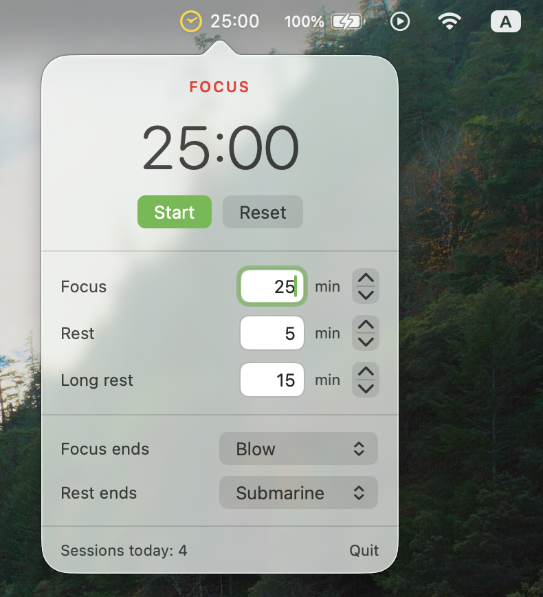

# Pomacdoro

A native macOS Pomodoro timer that lives in your menu bar.

The countdown is always on screen. Yellow while you focus, green while you rest.
No tab to switch to, no window to raise, no phone to pick up.


Click the item for the panel: countdown, Start, Pause, Reset, the three
durations, and the sound for each transition.



## Install

Needs macOS 13 or later and the Command Line Tools (`xcode-select --install`).
Full Xcode is not required.

```sh
git clone https://github.com/aq2208/pomacdoro.git
cd pomacdoro
./scripts/build-app.sh
cp -R dist/Pomacdoro.app ~/Applications/
open ~/Applications/Pomacdoro.app
```

The build is universal, for Apple silicon and Intel.

Prebuilt copies from the [releases page](https://github.com/aq2208/pomacdoro/releases)
are signed ad-hoc, not notarized, so macOS blocks them after a download. Clear
the flag with `xattr -dr com.apple.quarantine /path/to/Pomacdoro.app`, or just
build from source.

## How it behaves

- Focus, short rest, and a long rest after every fourth focus session. Each phase
  starts the next one itself, with a sound and a notification.
- Durations run from 1 to 180 minutes. A change applies the next time that phase
  comes around, so it never cuts a running phase short.
- Sounds are picked per transition from everything in `~/Library/Sounds` and the
  system sounds. Picking one plays it. `None` is silent.
- Time is tracked against the clock, not counted down, so a session survives a
  closed lid.
- 0.5% of one CPU core while running, nothing measurable while stopped, about
  42 MB of memory and a 1 MB bundle.

## Develop

```sh
./scripts/test.sh            # timer state machine and settings store
./scripts/build-app.sh       # dist/Pomacdoro.app
```

`Sources/Pomacdoro/PomodoroCore.swift` holds the state machine and has no AppKit,
so it is tested directly. `ClockIcon.swift` draws the clock for both the menu bar
and the app icon, so the two cannot drift apart, and `scripts/make-icon.swift`
turns it into the .icns.

The build calls `swiftc` directly and joins the two architecture slices with
`lipo`. Swift Package Manager is unusable here: some Command Line Tools
installations ship a stale `PackageDescription.private.swiftinterface` that the
compiler prefers, and no manifest will link against it. That is also why the
tests are a plain executable rather than XCTest.

## License

MIT. See [LICENSE](LICENSE).
